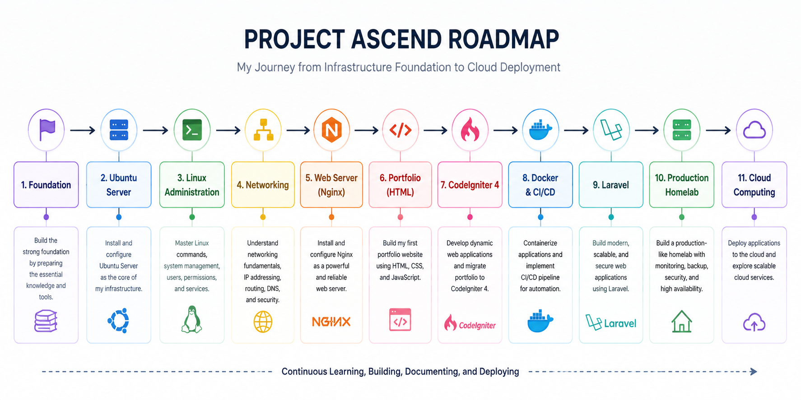

# Hi there, I'm Muhamad Ihsan Kurniawan

## Administration • Web Development • Networking • Homelab

I'm currently transitioning my career toward **Infrastructure, Backend Development, and DevOps Engineering** by building a complete **Personal Infrastructure Ecosystem** from the ground up.

Rather than only learning technologies, I'm building real-world projects that integrate Linux, Networking, Web Development, Automation, and Cloud Computing.

---

# Current Mission

Building a production-inspired **Personal Infrastructure Ecosystem** while transitioning into **Backend & Infrastructure Engineering**.

Every project is built, deployed, documented, and continuously improved through my self-hosted Ubuntu Server Homelab.

Current focus:

- 🐧 Linux Administration
- 🌐 Networking
- 💻 Backend Development
- 🐳 Docker & DevOps
- ☁️ Cloud Computing

---

<h2>Current Roadmap</h2>

#  Active Repositories

| Repository | Description |
|------------|-------------|
| career-evolution | My professional learning journey |
| homelab | Ubuntu Server & Infrastructure |
| linux-notes | Linux learning notes |
| networking-notes | Networking documentation |
| portfolio-html | Personal Portfolio (HTML/CSS/JS) |
| portfolio-codeigniter | Portfolio using CodeIgniter 4 |
| portfolio-laravel | Portfolio using Laravel |
| docker-lab | Docker & Containerization |
| bash-scripts | Linux Automation Scripts |
| dotfiles | Linux Configuration Files |

---

# Technologies

| Backend | Infrastructure | Networking | DevOps & Cloud |
|------------|------------|------------|------------|
| PHP *(Learning)* | Ubuntu Server *(Learning)* | TCP/IP *(Learning)* | Docker *(Learning)*|
| CodeIgniter4 *(Learning)* | Linux *(Learning)* | DNS *(Learning)* | Docker Compose *(Learning)* |
| Laravel *(Learning)* | Nginx *(Learning)* | Routing *(Learning)* | GitHub Actions *(Learning)* |
| HTML/CSS/JavaScript| Git & GitHub *(Learning)* | Network Design *(Learning)*| Cloud Computing *(Learning)* |

---

# Building in Public

Project Ascend Progress

🟨 Hardware Preparation *(In Progress)*

⬜ Ubuntu Server Setup

⬜ Linux & Networking Foundation 

⬜ Portfolio HTML

⬜ Portfolio CodeIgniter

⬜ Docker & CI/CD

⬜ Portfolio Laravel

⬜ Production Homelab

⬜ Cloud Deployment

| Current Goals | Currently Working On |
|------------|------------|
| Build a stable Ubuntu Server Homelab | Building my Ubuntu Server Homelab |
| Master Linux Administration & Networking Fundamentals  | Studying Linux Administration |
| Deploy my first HTML Portfolio using Nginx | Learning Networking Fundamentals |
| Migrate the portfolio to CodeIgniter 4 | Developing my HTML Portfolio |
| Prepare for Backend & Infrastructure Engineer opportunities | Documenting everything in Project Ascend |

---

# Connect With Me

- LinkedIn : *(Coming Soon)*
- Portfolio *(Coming Soon)*
- Email : ihsanfreelance21@gmail.com
- Instagram : [kakrantau ](https://www.instagram.com/kakrantau/)

---

> *"Saya sedang membangun sebuah Ubuntu Server Homelab, mendokumentasikan seluruh prosesnya, mengembangkan portfolio secara bertahap dari HTML ke CodeIgniter lalu Laravel, dan menggunakan proyek itu untuk berkembang menjadi Backend & Infrastructure Engineer."*
